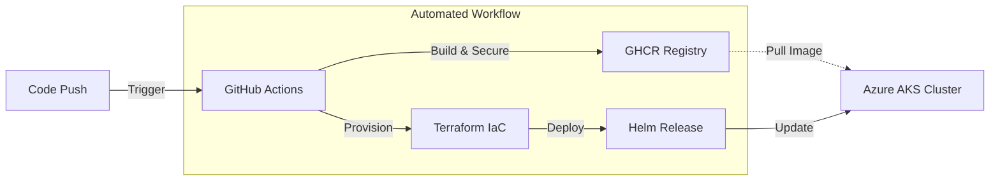

# Azure GitOps Starter


A modern, secure-by-default DevOps pipeline demonstrating **GitOps practices** using GitHub Actions, Azure, and Kubernetes.
The project automates the delivery of a Python application using minimal **Chainguard** images and Infrastructure as Code.



## Key Features & Architecture Decisions

* **Infrastructure as Code (IaC):**
    * **Terraform:** Fully automated Azure infrastructure provisioning (AKS, Networking, RBAC).
    * **State Management:** Configured with Azure Storage Account as a **remote backend** to ensure state consistency and team collaboration safety.
* **Containerization & Orchestration:**
    * **Multi-stage Docker Builds:** Optimized for smaller image size and security.
    * **Kubernetes (AKS) & Helm:** Application deployed via custom Helm charts for scalability and easy configuration management.
* **CI/CD Automation (GitHub Actions):**
    * Comprehensive pipeline including: Code Linting -> Docker Build -> Infrastructure Provisioning -> Helm Deployment.
    * **Zero-touch deployment:** Commits to `main` automatically trigger infrastructure updates and application rollout.

---

## Manual/Debug Setup

### Requirements

```
python3.12-venv
az CLI
terraform
kubectl
helm
```

### Snippets

#### Python

```bash
cd flask-app
python3 -m venv .venv
. .venv/bin/activate
pip install -r requirements.txt
flask --app dummy-endpoint run
```

#### Docker

```bash
docker build --no-cache -t JarnotMaciej/dummy-endpoint .
docker run -it -p 5000:5000 JarnotMaciej/dummy-endpoint:latest
docker compose up -d --build --force-recreate
```

#### Azure CLI

```bash
az login
az account list
az account set --subscription "<YOUR-SUBSCRIPTION-ID>"
az ad sp create-for-rbac --role="Contributor" --scopes="/subscriptions/<YOUR-SUBSCRIPTION-ID>"

export ARM_CLIENT_ID="<APPID_VALUE>"
export ARM_CLIENT_SECRET="<PASSWORD_VALUE>"
export ARM_SUBSCRIPTION_ID="<SUBSCRIPTION_ID>"
export ARM_TENANT_ID="<TENANT_VALUE>"
```

#### Terraform

```bash
cd terraform
export ARM_SAS_TOKEN="?sv=2020..."
terraform init
terraform validate
terraform plan -var-file=".tfvars"
terraform apply -var-file=".tfvars"
terraform output -raw kubernetes_config > ~/.kube/aks-config
export KUBECONFIG=~/.kube/aks-config
# echo "KUBECONFIG=~/.kube/aks-config" >> ~/.bashrc
terraform destroy -var-file=".tfvars"
```

#### kubectl && helm

```bash
kubectl get nodes
helm install demo-release ./chart
helm upgrade demo-release ./chart
watch -n 1 kubectl get service demo-service
```
